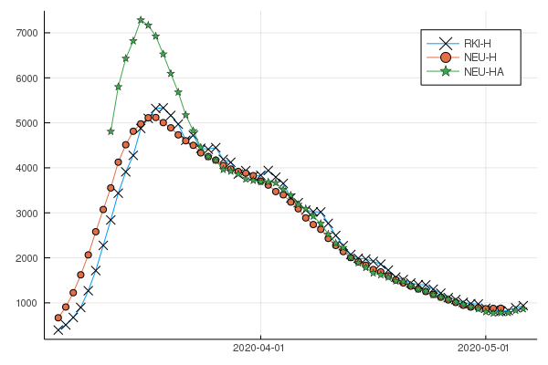
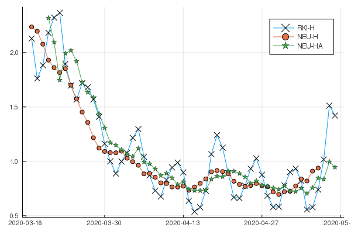
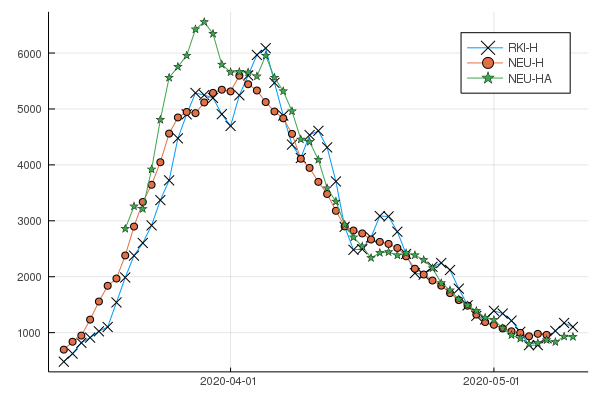

# Point estimators for reproduction number `R`

In the wake of the current pandemic, the reproduction number `R` takes on an important role.
It is defined as the average number of people who get infected by a typical case.
Ideally, we'd like to see `R` drop below 1 so that a pandemic (eventually) fades out.

We compare different point estimators for `R` with respect to their effectiveness in representing historical data.
Specifically, we compare an acausal point estimator that accurately accounts for weekly periodicities to the point estimator that has long been used by the Robert Koch Institut.

The code is based on the medRxiv submission `MEDRXIV/2020/100974`.

## Comparison based on historical data & estimated cases

The following plot shows three different point estimators, which we should explain first

| Name | Description |
| --- | --- |
| `RKI-H` | Estimator long used by Robert Koch Institut; effectively a 4-day moving average. |
| `NEU-H` | Acausal estimator that accounts for three days of the past, the current day, and three days of the future; this is entirely *fictitious* and used only for comparison. |
| `NEU-HA` | Acausal estimator that accounts for three days of the past, the current day, and three days of the future; future values are based on the respective values from the previous week. | 

The curves for the reproduction number `R` look as follows

### Analysis of `R`

#### Beginning 
Clearly, the `RKI-H` curve goes up drastically in the beginning, then winds and goes below `NEU-HA`.
In contrast, `NEU-H` reduces immediately; the behavior of `NEU-HA` mirrors that of `NEU-H` albeit with some lag.

#### Middle & end
About the time all reproduction number plots reach values below 1 we observe that `RKI-H` is much more *lively*, reacting more sensitive to the regime of below one.
The two `NEU` curves are more smooth, exhibiting a somewhat stable margin to the *magical* value of `R = 1`.
Given that values of `R = 1 ± ε` create a tremendous publicity, the advantage of the more smooth point estimators `NEU` is clear.

### Analysis of cases

Overall, the values of `NEU-H` and `RKI-H` coincide quite nicely; there is some lag for `RKI-H`.
In contrast the case numbers from `NEU-HA` are off to a large degree.
This is because `NEU-HA` bases its future predictions on past values -- a risky thing to do in times of rapidly changing dynamics.
Nevertheless, because `NEU-HA` computes its reproduction number also on the same internal forecasts, the [reproduction number](#analysis-of-`R`) appears to be fine.
Another thing to note from the cases is that although the predictions for the cases appear to overlap nicely toward the end, their effect on the reproduction number is still not negligible.

## Comparison based on historical data & confirmed cases

For the following plots we use the confirmed cases based on the figures provided by the Robert Koch Institut.
Note that with the confirmed cases we get a significant periodicity, because cases are not submitted on Sundays, for examples.

### Analysis of `R`

### Analysis of cases
